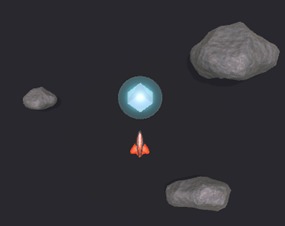
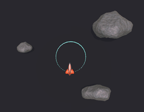
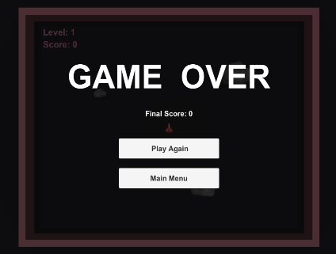
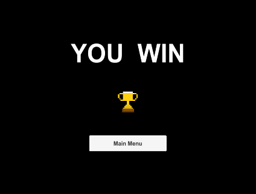

This is a 2.5D version of the classic game Asteroid, developed with Unity.

## Features
- **Interactive Gameplay:** Engage with keyboard controls to fly and shoot, enhancing player interaction.
- **Advanced Physics:** Float, bounce, and break mechanics for a more realistic experience.
- **Bullet Time:** Freeze asteroids for 3.5 seconds, providing a tactical gameplay element.
- **Engaging Levels:** Three levels of increasing difficulty.

## Screenshots
Bullet Time
<table>
<tr>
    <td></td>
    <td></td>
</tr>
</table>

Loose and Win
<table>
<tr>
    <td></td>
    <td></td>
</tr>
</table>

## How to Play
1. Use arrow keys to navigate your spaceship.
2. Press the spacebar to shoot asteroids.
3. Collect supply packs to activate 'Bullet Time'.
4. Clear all levels to win the game.

## Run the game
Go to [release](https://github.com/YankFitzgerald/Asteroids-2.5D/releases/tag/v1.0).
Download and unzip, double click Asteroid.exe to play.
